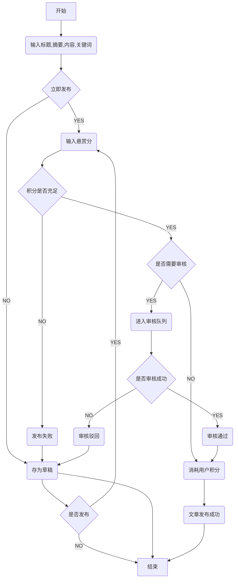

# 发帖流程 #

```mermaid
graph TB
   start[开始] --> inputBaseInfo(输入标题,摘要,内容,关键词)
   inputBaseInfo --> releaseImmediately{立即发布}
   releaseImmediately -- YES --> inputRewardScore(输入悬赏分)
   inputRewardScore --> hasEnoughScore{积分是否充足}
   releaseImmediately -- NO --> saveAsDraft(存为草稿)
   saveAsDraft --> release{是否发布}
   release -- YES --> inputRewardScore
   release -- NO --> stop[结束]
   saveAsDraft --> stop

   hasEnoughScore -- NO --> releaseFailed(发布失败)
   releaseFailed --> saveAsDraft

   hasEnoughScore -- YES --> needAuditing{是否需要审核}
   needAuditing -- NO --> changeUserScore
   released --> stop

   needAuditing -- YES --> enqueueAuditing(进入审核队列)
   enqueueAuditing --> auditing{是否审核成功}
   auditing -- YES --> passed(审核通过)
   passed --> changeUserScore(消耗用户积分)
   changeUserScore --> released(文章发布成功)

   auditing -- NO --> rejected(审核驳回)
   rejected --> saveAsDraft
```